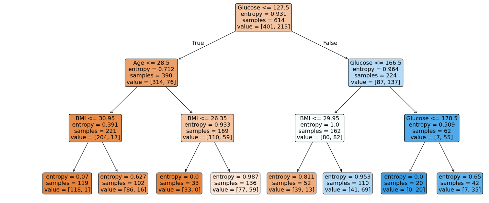

# 🩺 Diabetes Prediction Using Decision Tree (PIMA Indian Dataset)

This project is a machine learning classification model built using a **Decision Tree Classifier** to predict whether a patient has diabetes based on health-related attributes. The dataset used is the popular **PIMA Indian Diabetes dataset**.

---

## 📊 Dataset Overview

The dataset contains the following features:

- **Pregnancies**
- **Glucose**
- **BloodPressure**
- **SkinThickness**
- **Insulin**
- **BMI**
- **DiabetesPedigreeFunction**
- **Age**
- **Outcome** (0 = No Diabetes, 1 = Diabetes)

---

## 📌 Project Workflow

1. **Data Cleaning**
   - Replaced zero values in `Glucose`, `BloodPressure`, `SkinThickness`, `Insulin`, `BMI` with their respective median values.

2. **Feature Selection**
   - Selected all relevant features for training.

3. **Train-Test Split**
   - Split the data into 80% training and 20% testing sets.

4. **Model Training**
   - Applied a **Decision Tree Classifier** using the `entropy` criterion.
   - Tuned the `max_depth` hyperparameter for optimal accuracy.

5. **Model Evaluation**
   - Evaluated using **accuracy score**, **precision**, **recall**, and **F1-score**.
   - Plotted the decision tree and feature importance graph.

---

## 📈 Results

- **Best Model Accuracy:** 77.27% (with `max_depth=3`)
- **Top 3 Important Features:**
  1. Glucose
  2. BMI
  3. Age

---

## 📊 Visualizations

- Decision Tree Plot

- Feature Importance Bar Plot

---

## 📦 Libraries Used

- `pandas`
- `numpy`
- `matplotlib`
- `sklearn`

---

## 📚 Conclusion

The project successfully built a Decision Tree model to classify diabetes outcomes. The most influential factors identified were **Glucose**, **BMI**, and **Age**.

---

